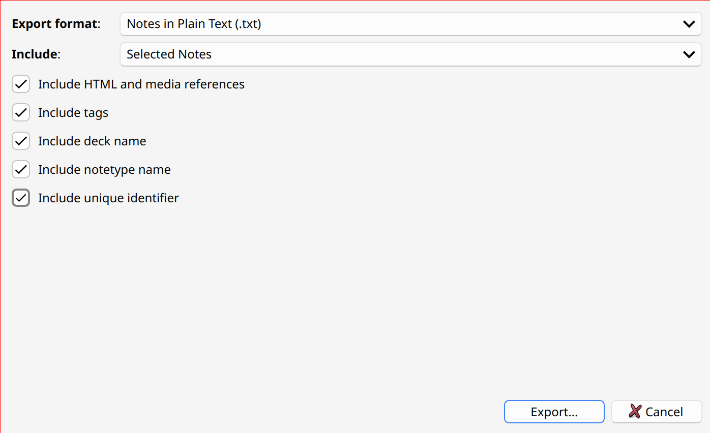

### Recommended way to export Notes from Anki

To export notes from `anki` in a way that is compatible with `anki-ai` select the following options:

This will ensure we can apply changes to the Notes, and then upload them back in Anki without losing the progress and statistics associated with each Note.
